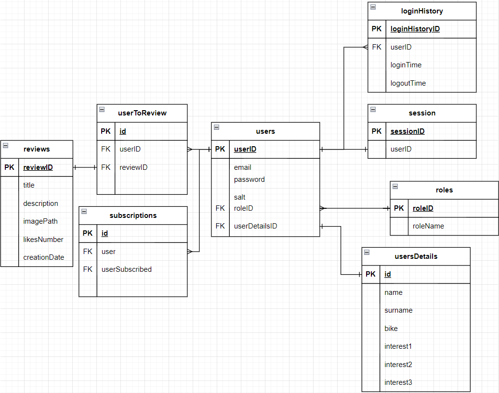

# Project name - Gosafe
Service to share reviews of motorcycle accessories for motorcycle community

## Table od contents
* [General info](#general-info)
* [Technologies](#technologies)
* [Setup](#setup)
* [Features](#features)
* [Screenshots](#screenshots)
* [Status](#status)
* [Inspirations](#inspirations)
* [Contact](#contact)


## General info
To use the service, You should login (register). 
After that user can read other reviewas or create his own.
Remember to add image of reviewed product! :D


## Technologies
* Nginx version: 1.17.8-alpine
* PHP version: 8.1.3-fpm-alpine3.15
* Docker version: 3

## Setup
To run the project, 
- clone that repo and run  docker-compose:

    ```
    $ docker-compose up
    ```

- add credentials to connect to the database

## Entity Relationship Diagram



## Contact
Please feel free to contact me in case of any questions:

`aleksander.kuzmicz1@gmail.com`